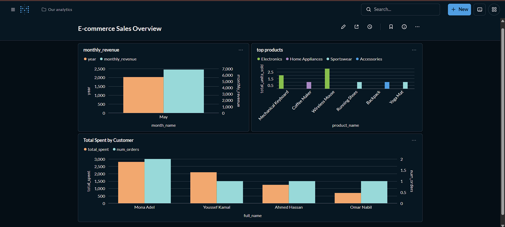

# 🛒 E-commerce Data Pipeline

A local, end-to-end data engineering pipeline built from scratch — simulating
a real-world e-commerce ETL/ELT workflow: from a raw OLTP source database,
through orchestrated transformation into a dimensional (Star Schema)
warehouse, tested and ready for analytics.

Built as a hands-on learning project to apply data warehousing, ETL/ELT,
and orchestration concepts in a real, reproducible environment.

---

## 📊 Dashboard Preview



---

## 🏗️ Architecture

```
┌─────────────┐        ┌──────────────────┐        ┌─────────────────────┐
│  source_db  │──ETL──▶│ warehouse_db     │──dbt──▶│ warehouse_db         │
│  (OLTP)     │ Python │  .staging        │  SQL   │  .public             │
│  Postgres   │ raw    │  (raw copy)      │        │ (dim_*, fact_*)      │
└─────────────┘  load  └──────────────────┘        └─────────────────────┘
                              ▲
                              │
                    ┌─────────────────────┐
                    │   Apache Airflow     │
                    │ (schedules + runs    │
                    │  the raw load daily) │
                    └─────────────────────┘
```

**Flow:** raw OLTP data is extracted and loaded as-is into a `staging` schema
inside the warehouse (ELT approach). dbt then transforms staging tables into
a proper Star Schema — all transformation logic lives in version-controlled,
tested SQL instead of application code.

Everything runs in isolated Docker containers, orchestrated by Airflow on a
daily schedule.

---

## 🛠️ Tech Stack

| Layer            | Tool                                |
|-------------------|--------------------------------------|
| Databases         | PostgreSQL 15 (source, warehouse, Airflow metadata) |
| Containerization  | Docker & Docker Compose             |
| Raw Extract/Load  | Python (pandas, SQLAlchemy, psycopg2) |
| Orchestration     | Apache Airflow (LocalExecutor)      |
| Transformation    | dbt (dbt-postgres)                  |
| Testing           | dbt tests (unique, not_null, relationships) |
| Visualization     | Metabase                            |

---

## 📂 Project Structure

```
.
├── docker/
│   └── docker-compose.yml       # Spins up all services
├── source_db/
│   └── init.sql                 # OLTP schema + seed data
├── warehouse_db/
│   ├── warehouse_schema.sql     # Legacy star schema DDL (reference)
│   └── staging_schema.sql       # Raw staging schema
├── etl/
│   ├── etl.py                   # Extract + raw load (source → staging)
│   └── requirements.txt
├── airflow/
│   └── dags/
│       └── ecommerce_etl_dag.py # Daily DAG triggering the raw load
├── dbt_project/
│   └── models/
│       ├── staging/             # Thin views over staging schema
│       │   ├── sources.yml
│       │   ├── stg_customers.sql
│       │   ├── stg_products.sql
│       │   ├── stg_orders.sql
│       │   └── stg_order_items.sql
│       └── marts/               # Star Schema (dims + fact)
│           ├── dim_date.sql
│           ├── dim_customer.sql
│           ├── dim_product.sql
│           ├── fact_order_items.sql
│           └── schema.yml       # Tests & documentation
├── .gitignore
└── README.md
```

---

## 🗂️ Data Model

**Source (OLTP)** — normalized, transactional:
`customers`, `products`, `orders`, `order_items`

**Warehouse (Star Schema)** — grain: **one row per order line item**

| Table | Type | Notes |
|---|---|---|
| `fact_order_items` | Fact | quantity, unit_price, line_total, FKs to all dimensions |
| `dim_customer` | Dimension (SCD Type 2) | tracks customer changes via `valid_from`/`valid_to`/`is_current` |
| `dim_product` | Dimension (SCD Type 1) | current product attributes |
| `dim_date` | Dimension | day, month, quarter, year, weekend flag |

`order_items.unit_price` is stored separately from `products.unit_price` to
preserve the actual price at the time of sale, independent of later price
changes.

---

## 🚀 Getting Started

### Prerequisites
- Docker Desktop
- Python 3.10+
- dbt (`pip install dbt-postgres`)

### 1. Start all services
```bash
cd docker
docker compose up -d
```

This spins up:
| Service | Purpose | Access |
|---|---|---|
| `source_db` | Raw OLTP data | `localhost:5433` |
| `warehouse_db` | Staging + Star Schema | `localhost:5434` |
| `airflow_db` | Airflow metadata | internal only |
| `airflow-webserver` | Airflow UI | `localhost:8080` (admin/admin) |
| `airflow-scheduler` | Runs the DAG daily | — |
| `metabase` | BI dashboard | `localhost:3000` |

### 2. Run the raw load (Extract + Load)
```bash
cd etl
pip install -r requirements.txt
python etl.py
```
This copies raw data from `source_db` into `warehouse_db.staging`, untouched.

> Alternatively, trigger the `ecommerce_etl_pipeline` DAG from the Airflow UI
> at `localhost:8080` — it runs the same script inside its own container.

### 3. Run the dbt transformations
```bash
cd dbt_project
dbt run
dbt test
```
This builds the staging views and Star Schema marts, then runs 16 data
quality tests (uniqueness, not-null, referential integrity).

### 4. Explore the results
```bash
docker exec -it ecommerce_warehouse_db psql -U warehouse_user -d ecommerce_warehouse
```
```sql
SELECT c.full_name, SUM(f.line_total) AS total_spent
FROM fact_order_items f
JOIN dim_customer c ON f.customer_sk = c.customer_sk
WHERE f.order_status = 'completed'
GROUP BY c.full_name
ORDER BY total_spent DESC;
```

### 5. Visualize with Metabase
Open `localhost:3000`, create an admin account, and connect a PostgreSQL
database with:

| Field | Value |
|---|---|
| Host | `warehouse_db` |
| Port | `5432` |
| Database name | `ecommerce_warehouse` |
| Username | `warehouse_user` |
| Password | `warehouse_pass` |

> Note: use the container name (`warehouse_db`) and internal port (`5432`),
> not `localhost`/`5434` — Metabase runs on the same Docker network as the
> other services.

From there, build questions and dashboards directly on top of
`fact_order_items`, `dim_customer`, `dim_product`, and `dim_date`.

---

## 📈 Roadmap

- [x] Dockerized source OLTP database
- [x] Star Schema warehouse design
- [x] Python raw Extract + Load (source → staging)
- [x] Orchestration with Apache Airflow (daily DAG)
- [x] dbt: staging models, marts, and data tests
- [x] BI dashboard (Metabase)

---

## 📝 Key Learnings

- **ELT over ETL**: raw data lands in the warehouse first; all
  transformation logic lives in dbt as tested, version-controlled SQL.
- **Grain matters**: the fact table grain (one row per order line item) was
  decided upfront, before any modeling — everything else follows from it.
- **Surrogate vs. natural keys**: `customer_sk`/`product_sk` decouple the
  warehouse from source-system IDs, enabling SCD Type 2 history tracking.
- **Reproducibility**: the entire pipeline can be torn down
  (`docker compose down -v`) and rebuilt from scratch with identical results
  — a core requirement for real-world data infrastructure.
